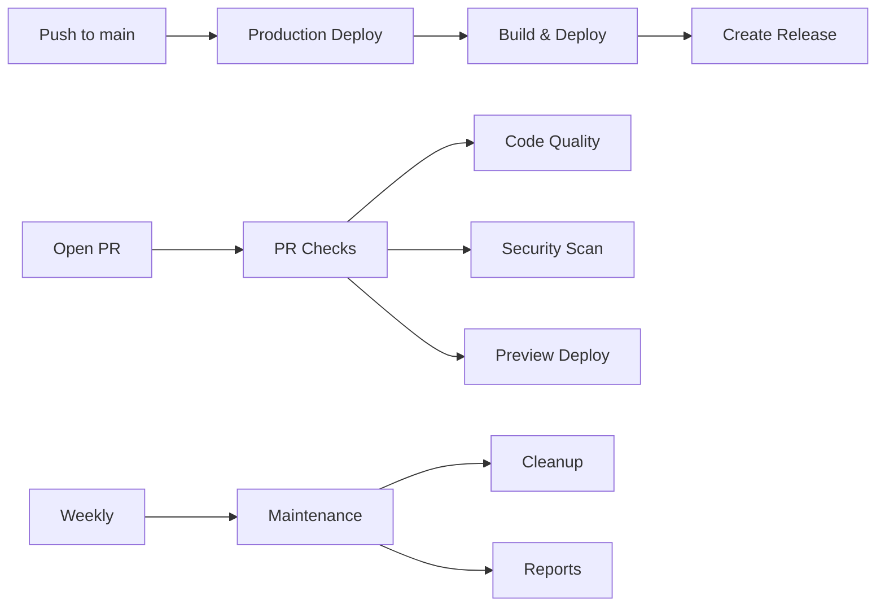

# 🚀 CI/CD Pipeline Guide

This guide explains the optimized CI/CD pipeline for Recharge Travels Sri Lanka.

## 📋 Overview

Our CI/CD pipeline is designed for a large TypeScript codebase (819+ files) with the following goals:
- **Fast builds** using optimized Vite configuration
- **Automatic deployments** on push to main
- **Preview deployments** for pull requests
- **Comprehensive quality checks**
- **Efficient caching** to speed up builds

## 🔄 Workflows

### 1. Production Deployment (`deploy-production.yml`)

**Trigger:** Push to `main` branch or manual dispatch

**Features:**
- 🚀 Uses fast build configuration (skips TypeScript checking)
- 📦 Caches dependencies and build outputs
- 🔐 Deploys to Firebase production environment
- 🏷️ Creates automatic version tags and releases
- 🔔 Sends deployment notifications (if Slack webhook configured)

**Build time:** ~2-3 minutes (vs 10+ minutes with standard build)

### 2. Staging Deployment (`deploy-staging.yml`)

**Trigger:** Push to `develop`/`staging` or any pull request

**Features:**
- 🔗 Creates preview URLs for pull requests
- 💬 Comments preview URL on PR automatically
- 🧪 Runs basic tests (non-blocking)
- ⏱️ 7-day expiration for preview deployments

### 3. PR Checks (`pr-checks.yml`)

**Trigger:** Pull request events

**Checks performed:**
- ✅ TypeScript compilation
- 🎨 ESLint code quality
- 📊 Bundle size analysis
- 🔐 Security vulnerability scan
- 🏷️ Auto-labeling based on changed files

### 4. Scheduled Maintenance (`scheduled-maintenance.yml`)

**Trigger:** Weekly (Sunday 2 AM UTC) or manual

**Tasks:**
- 📦 Check for outdated dependencies
- 🗑️ Clean up old artifacts
- 🧹 Manage GitHub Actions cache
- 📊 Generate repository statistics

## ⚡ Performance Optimizations

### Fast Build Configuration

Both main and admin projects have `vite.config.fast.ts` that:
- Skips TypeScript type checking
- Disables source maps
- Skips minification (for staging/dev)
- Uses aggressive code splitting

```bash
# Regular build (10+ minutes)
npm run build

# Fast build (2-3 minutes)
npm run build:fast
```

### Caching Strategy

1. **Dependency Cache**
   - Key: `${{ runner.os }}-node-${{ hashFiles('**/package-lock.json') }}`
   - Caches: node_modules, admin/node_modules, ~/.npm

2. **Build Cache**
   - Key: `${{ runner.os }}-build-${{ github.sha }}`
   - Caches: dist, admin/dist, .vite

### Concurrency Control

- Production deployments: No concurrent runs allowed
- Staging deployments: Cancel previous runs for same PR

## 🔧 Configuration

### Required Secrets

Configure these in GitHub Repository Settings → Secrets:

```yaml
# Required
FIREBASE_SERVICE_ACCOUNT    # Firebase service account JSON
GITHUB_TOKEN               # Automatically provided

# Optional (defaults provided)
VITE_FIREBASE_API_KEY
VITE_FIREBASE_AUTH_DOMAIN
VITE_FIREBASE_PROJECT_ID
VITE_FIREBASE_STORAGE_BUCKET
VITE_FIREBASE_MESSAGING_SENDER_ID
VITE_FIREBASE_APP_ID
VITE_FIREBASE_MEASUREMENT_ID
VITE_GOOGLE_MAPS_API_KEY
VITE_PAYHERE_MERCHANT_ID
VITE_PAYHERE_MERCHANT_SECRET

# For notifications
SLACK_WEBHOOK              # Slack webhook URL
```

### Environment Variables

The workflows automatically set up `.env` files with:
- Firebase configuration
- Google Maps API key
- Payment gateway settings
- Environment-specific values (production vs sandbox)

## 📊 Monitoring

### Build Status Badges

Add to your README:
```markdown


```

### Deployment Notifications

If Slack webhook is configured:
- ✅ Successful deployments
- ❌ Failed deployments
- 📋 Includes branch, commit, and author info

## 🛠️ Troubleshooting

### Common Issues

1. **Build fails with "out of memory"**
   - The fast build config helps prevent this
   - If still occurring, increase Node.js memory limit

2. **Firebase deployment fails**
   - Check `FIREBASE_SERVICE_ACCOUNT` secret is valid JSON
   - Ensure Firebase project ID matches

3. **Cache not working**
   - Check if package-lock.json has changed
   - Manually clear cache in Actions settings if needed

### Manual Deployment

If automated deployment fails:

```bash
# Local deployment
npm run build:fast
firebase deploy --only hosting

# With specific target
firebase deploy --only hosting:main
firebase deploy --only hosting:admin
```

## 🎯 Best Practices

1. **Use fast builds** for all deployments
2. **Keep PRs small** for faster checks
3. **Fix lint errors locally** with `npm run lint:fix`
4. **Monitor bundle sizes** in PR checks
5. **Review security warnings** from automated scans
6. **Tag releases** are created automatically

## 📈 Metrics

Expected performance with optimizations:
- **Dependency install:** 30-45 seconds (with cache)
- **Fast build:** 1-2 minutes
- **Total deployment:** 2-3 minutes
- **PR checks:** 3-5 minutes

## 🔄 Workflow Diagram



---

For more information, see:
- [Branch Protection Rules](.github/BRANCH_PROTECTION_RULES.md)
- [GitHub Actions Documentation](https://docs.github.com/actions)