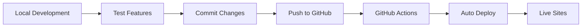

# Project Status & Workflow - Recharge Travels

## 🎯 Current Project Status

### ✅ Completed Features

1. **Main Website**
   - ✓ Premium responsive design
   - ✓ Custom domain: https://www.rechargetravels.com
   - ✓ Rich footer with animations and glass effects
   - ✓ Google Places API integration (Firebase-only)
   - ✓ Transfer booking system
   - ✓ Multiple tour packages
   - ✓ Hotel search and booking
   - ✓ Driver/vehicle services
   - ✓ Wildlife tours section
   - ✓ Cultural heritage tours

2. **Admin Panel**
   - ✓ Separated from main site
   - ✓ URL: https://recharge-travels-admin.web.app
   - ✓ Hardcoded authentication (temporary)
   - ✓ Complete CMS functionality
   - ✓ Real-time Firestore data
   - ✓ All website functions integrated
   - ✓ Content management
   - ✓ Photo uploads
   - ✓ Tour/Hotel/Driver management

3. **Infrastructure**
   - ✓ Firebase Hosting (multi-site)
   - ✓ GitHub Actions CI/CD
   - ✓ Automatic deployments
   - ✓ Custom domain configured
   - ✓ SSL certificates active
   - ✓ No Supabase dependencies (Firebase-only)

## 📊 Recent Updates

### Latest Changes (January 2025)
1. **Footer Redesign**
   - Premium glass morphism effects
   - Smooth animated backgrounds
   - Enhanced typography and spacing
   - Trust badges section
   - Improved contact card

2. **Google Places API Fix**
   - Removed all Supabase dependencies
   - Direct Google Maps JavaScript API integration
   - Better performance with debouncing
   - Visual status indicators
   - Fallback to local Sri Lankan locations

3. **Custom Domain Deployment**
   - www.rechargetravels.com fully configured
   - Automatic SSL renewal
   - Both sites accessible via custom domains

## 🔄 Current Workflow

### Development Process


### Quick Commands
```bash
# Development
npm run dev              # Main site (port 5173)
npm run dev:admin        # Admin panel (port 5174)
npm run dev:all          # Both sites

# Building
npm run build            # Build main site
npm run build:admin      # Build admin
npm run build:all        # Build both

# Deployment
npm run deploy:all       # Deploy everything
npm run deploy:main      # Main site only
npm run deploy:admin     # Admin only
```

## 🌐 Live URLs

| Site | URL | Status |
|------|-----|--------|
| Main Website | https://www.rechargetravels.com | ✅ Live |
| Firebase URL | https://recharge-travels-73e76.web.app | ✅ Live |
| Admin Panel | https://recharge-travels-admin.web.app | ✅ Live |

## 🔑 Access Credentials

### Admin Panel
- **URL**: https://recharge-travels-admin.web.app
- **Email**: nanthan77@gmail.com
- **Password**: recharge2024admin

## 🛠️ Technology Stack

### Frontend
- React 18.3.1 with TypeScript
- Vite build system
- Tailwind CSS for styling
- Framer Motion for animations
- React Router for navigation
- React Hook Form for forms
- Zod for validation

### Backend & Services
- Firebase Hosting
- Firebase Firestore
- Firebase Storage
- Firebase Authentication
- Google Maps JavaScript API
- Google Places API

### DevOps
- GitHub Actions CI/CD
- Firebase CLI
- Multi-site hosting
- Automatic SSL certificates

## 📋 Pending Tasks

### High Priority
- [ ] Enable Firebase Email/Password authentication
- [ ] Implement proper admin user management
- [ ] Add payment gateway integration
- [ ] Set up email notifications

### Medium Priority
- [ ] Optimize bundle size (currently 1.7MB)
- [ ] Add image optimization
- [ ] Implement caching strategies
- [ ] Add PWA features

### Low Priority
- [ ] Add more animations
- [ ] Create mobile app
- [ ] Add multi-language support
- [ ] Implement A/B testing

## 🚀 Deployment Workflow

### 1. Manual Deployment
```bash
# Full deployment
npm run deploy:all

# Or use the script
./scripts/deploy-all.sh
```

### 2. Automatic Deployment
Push to main branch triggers automatic deployment:
```bash
git add .
git commit -m "Your changes"
git push origin main
```

### 3. Verify Deployment
1. Check GitHub Actions: [View Status](https://github.com/nanthan77/rechargetravels-sri-lankashalli-create-in-github/actions)
2. Visit live sites
3. Test new features
4. Check browser console for errors

## 🐛 Known Issues

1. **TypeScript Errors**: Build shows warnings but completes successfully
2. **Bundle Size**: Main chunk is large (1.7MB), needs optimization
3. **Firebase Auth**: Using hardcoded auth instead of Firebase Auth
4. **Font Loading**: Some font files show warnings during build

## 📝 Development Guidelines

### Code Style
- Use functional components with hooks
- Follow existing patterns in codebase
- Keep components small and focused
- Use TypeScript types properly
- No comments unless explicitly needed

### Git Workflow
1. Make changes locally
2. Test thoroughly
3. Commit with clear messages
4. Push to main for auto-deploy
5. Monitor deployment status

### Testing Checklist
- [ ] Test on desktop browsers
- [ ] Test on mobile devices
- [ ] Check console for errors
- [ ] Verify API integrations
- [ ] Test form submissions
- [ ] Check responsive design

## 🔐 Security Notes

- API keys in environment variables
- No sensitive data in code
- Admin panel on separate subdomain
- All traffic over HTTPS
- Regular security audits recommended

## 📈 Performance Metrics

- **Lighthouse Score**: To be measured
- **Load Time**: ~3-4 seconds
- **Bundle Size**: 1.7MB (needs optimization)
- **API Response**: Google Places ~200-500ms

## 🆘 Troubleshooting

### Google Places API Not Working
1. Check browser console for errors
2. Verify API key in environment
3. Ensure Places API is enabled in Google Cloud
4. Check domain restrictions

### Build Failures
```bash
# Clean install
npm run clean
npm run install:all
npm run build:all
```

### Deployment Issues
```bash
# Re-authenticate
firebase login:reauth
firebase use recharge-travels-73e76
firebase deploy
```

## 📚 Documentation

| Document | Description |
|----------|-------------|
| README.md | Project overview |
| GITHUB_ACTIONS_SETUP.md | CI/CD configuration |
| CUSTOM_DOMAIN_DEPLOYMENT.md | Domain setup guide |
| GOOGLE_PLACES_API_SETUP.md | API configuration |
| COMPLETE_DEPLOYMENT_WORKFLOW.md | Deployment guide |

---

**Last Updated**: January 2025
**Project Status**: 🟢 Active Development
**Next Milestone**: Payment Gateway Integration